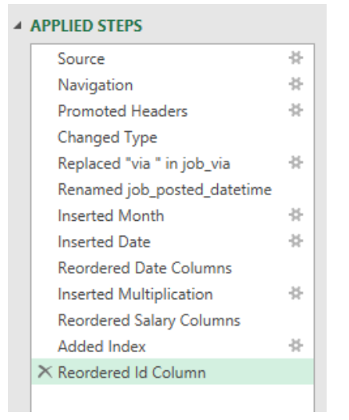
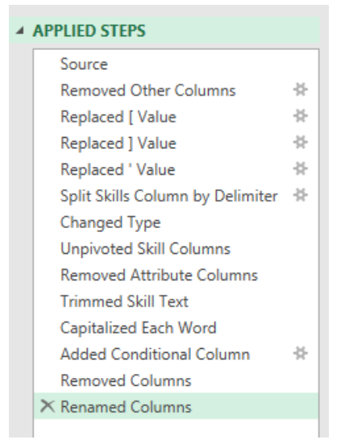
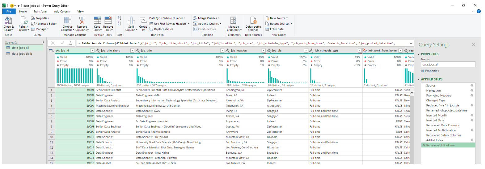
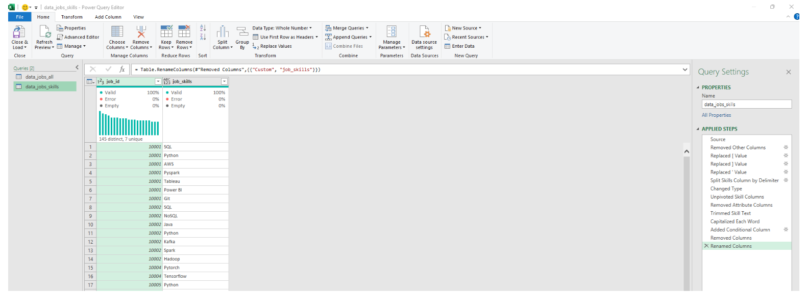
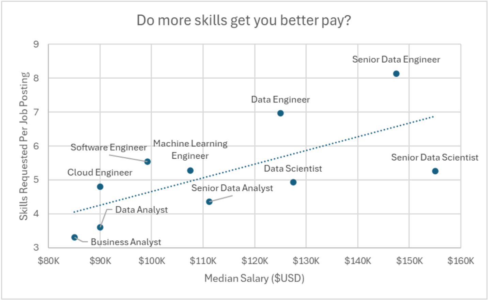
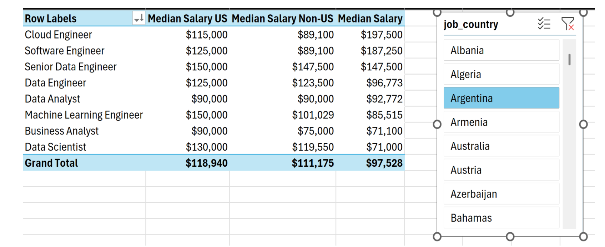
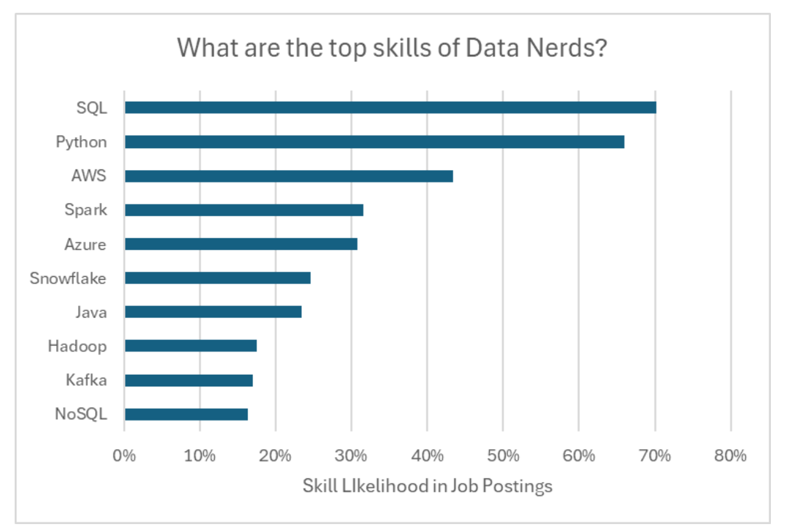

# Project 2 — Data Job Market Analysis (Excel)

## Overview  
This project analyzes the 2023 data job market using Microsoft Excel. The focus is on understanding how skills, job titles, and geographical regions influence salary trends in data-related roles.  
It demonstrates my skills in Power Query, Power Pivot, DAX, PivotTables, and data visualization — tools widely used in analytics and BI roles.

---

## Objectives  
I structured the analysis around four key questions:

1. Do more skills lead to higher salaries?  
2. How do salaries vary across regions?  
3. What are the most in-demand skills in the data industry?  
4. Which top skills offer the highest pay?

---

## Tools & Excel Skills Used  

### Power Query  
- Cleaned and transformed raw data  
- Adjusted column types and removed unnecessary fields  
- Standardized text formats  
- Created a separate skills table from job listings  

### Power Pivot  
- Built a relational data model  
- Created relationships between job and skill tables  

### DAX  
- Created custom measures  
- Used MEDIAN to calculate salary metrics  

### PivotTables & PivotCharts  
- Summarized salary trends  
- Built combo charts and bar charts for insights  

---

# 1️⃣ Do More Skills Lead to Better Pay?

## Data Preparation  
After cleaning the dataset with Power Query, two tables were prepared:
- A job listings table  
- A skills table mapped to each job ID

  ## 1️⃣ Do More Skills Lead to Better Pay?

### 🔍 Skill: Power Query (ETL)

---

## 📥 Extract  
I imported the raw dataset into Power Query and created two separate queries:
- A main table containing all job information  
- A linked skills table broken out by job ID  

---

## 🔄 Transform  
I performed the following transformations for both queries:
- Changed column data types  
- Removed unwanted fields  
- Cleaned text and standardized formatting  
- Trimmed unnecessary whitespace  

### 📊 data_jobs_all  
Applied Steps (Power Query):



### 🛠️ data_job_skills  
Applied Steps (Power Query):



---

## 🔗 Load  
After transformation, both queries were loaded into the Excel workbook to build the foundation for further analysis.

### 📊 data_jobs_all  
Loaded Table:



### 🛠️ data_job_skills  
Loaded Table:



---

## 📊 Analysis

### 💡 Insights  
📈 There is a clear positive correlation between the **number of skills** listed for a job and the **median salary**, especially for highly technical roles such as:  
- Senior Data Engineer  
- Data Scientist  

💼 Roles that list fewer skills — such as Business Analyst — tend to show **lower salary ranges**, indicating that specialized technical skills significantly increase market value.

### 📉 Visualization


 


## Findings  
- Jobs requiring a higher number of technical skills offer significantly higher median salaries.  
- Roles such as Senior Data Engineer and Data Scientist show a strong link between skill count and pay.  

## Insight  
Developing multiple relevant skills — especially technical ones — clearly aligns with higher earning potential.

---

# 2️⃣ How Do Salaries Differ by Region?

## PivotTable + DAX  
Regional salary comparisons were done using a PivotTable and a DAX measure:

```
Median Salary := MEDIAN(data_jobs_all[salary_year_avg])
```

## Findings  
- US-based roles consistently show higher median salaries.  
- The pay gap widens for senior and technical roles such as engineering and data science.  

## Insight  
Geography plays a major role in compensation. US roles offer the strongest salary growth.

---

# 3️⃣ What Are the Most In-Demand Skills?

## Data Model  
Using Power Pivot, the job listings and skills tables were connected using `job_id`. This allowed calculating skill frequency and ranking.

## Findings  
- SQL and Python are the most common skills across data jobs.  
- Cloud technologies like AWS and Azure show strong demand growth.  


## Insight  
Programming + cloud skills remain essential core competencies in the industry.

---

# 4️⃣ What Are the Highest-Paying Skills?

## Combo Chart  
Created a combination PivotChart showing:
- Median Salary (columns)  
- Skill Likelihood (%) (line markers)

## Findings  
- Python, SQL, and Oracle skills correspond to the highest median salaries.  
- General office skills like Word or PowerPoint show the lowest salary influence.  

## Insight  
High-value technical skills have the greatest impact on earning potential.

---

# Conclusion  
This project provided a detailed view of the data job market using Excel’s advanced analytics features.  
Key takeaways include:

- More skills generally lead to higher salaries  
- Location strongly influences compensation  
- SQL, Python, and cloud skills dominate the industry  
- Technical expertise directly correlates with higher pay  

This project highlights my ability to perform data cleaning, modeling, analysis, and visualization in Excel — making it a valuable addition to my analytics portfolio.
